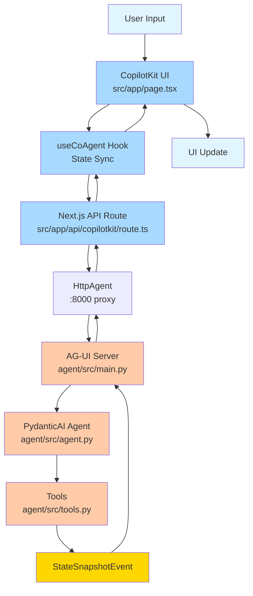

# CopilotKit <> PydanticAI Todo App

A hands-on experiment with the new [AG-UI protocol](https://ai.pydantic.dev/agents-ui/) that bridges [PydanticAI](https://ai.pydantic.dev/) Python agents with [CopilotKit](https://copilotkit.ai) React UIs.

This protocol is genuinely interesting because it solves a real problem: getting Python AI agents to work seamlessly with modern web UIs. Instead of building REST APIs or dealing with websockets manually, AG-UI gives you bidirectional state synchronization out of the box. Your Python agent updates state, and your React UI reflects it automatically—and vice versa.

The demo is a todo board with three columns (Todo, In-Progress, Done), but the real point is to experiment with the protocol itself and see how it works.

## Prerequisites

- OpenAI API Key (for the PydanticAI agent)
- Python 3.12+
- uv
- Node.js 20+ 
- Any of the following package managers:
  - pnpm (recommended)
  - npm
  - yarn
  - bun

## Getting Started

1. Install dependencies using your preferred package manager:
```bash
# Using pnpm (recommended)
pnpm install

# Using npm
npm install

# Using yarn
yarn install

# Using bun
bun install
```

> **Note:** This will automatically setup the Python environment as well.
>
> If you have manual issues, you can run:
>
> ```sh
> npm run install:agent
> ```


2. Set up your API keys:

Create a `.env` file inside the `agent` folder with the following content:

```bash
# Required: Get from https://platform.openai.com/api-keys
OPENAI_API_KEY=sk-...your-openai-key-here...

# Optional: For agent observability
# Sign up at https://logfire.pydantic.dev
# Create token: https://logfire.pydantic.dev/docs/how-to-guides/create-write-tokens/
LOGFIRE_TOKEN=...your-logfire-token...
```

3. Start the development server:
```bash
# Using pnpm
pnpm dev

# Using npm
npm run dev

# Using yarn
yarn dev

# Using bun
bun run dev
```

This starts both the UI and agent servers. Open your browser and try interacting with the chat to see the protocol in action.

## How It Works

The AG-UI protocol connects three pieces to create a full-stack agentic application:

### The Stack

1. **[PydanticAI](https://ai.pydantic.dev/)** ([`agent/src/agent.py`](agent/src/agent.py)) - Python AI agent framework
   - Defines the agent with GPT-4.1-mini model and tools
   - Tools ([`agent/src/tools.py`](agent/src/tools.py)): `add_todos`, `update_todo`, `delete_todos`, etc.
   - Uses Pydantic models ([`agent/src/models.py`](agent/src/models.py)) for type-safe state

2. **[AG-UI Protocol](https://ai.pydantic.dev/agents-ui/)** ([`agent/src/main.py`](agent/src/main.py)) - The bridge layer
   - One line (`agent.to_ag_ui()`) turns your PydanticAI agent into a FastAPI server (port 8000)
   - Handles bidirectional state synchronization via `StateSnapshotEvent`
   - This is the interesting part—it's what makes Python ↔ React communication work without manual API building

3. **[CopilotKit](https://copilotkit.ai/)** ([`src/app/page.tsx`](src/app/page.tsx), [`src/app/api/copilotkit/route.ts`](src/app/api/copilotkit/route.ts)) - React chat UI
   - `useCoAgent()` creates bidirectional state sync with backend
   - `HttpAgent` connects to Python AG-UI server
   - Renders tool calls with custom UI components

<details>
<summary><strong>🔍 Technical Deep Dive -></strong></summary>

### Architecture



### Data Flow

Here's what happens when you interact with the chat:

1. User types in chat → CopilotKit sends to `/api/copilotkit`
2. Next.js proxies via `HttpAgent` to Python backend (localhost:8000)
3. PydanticAI agent calls tools (e.g., `add_todos`)
4. Tools return `StateSnapshotEvent` with updated state
5. AG-UI pushes state back through CopilotKit
6. `useCoAgent` updates React UI automatically

The key insight is step 4-6: instead of building REST endpoints, the agent just returns state changes and the protocol handles syncing them to the UI.

### Key Files

- [`src/app/page.tsx`](src/app/page.tsx) - CopilotKit integration & state sync
- [`src/app/api/copilotkit/route.ts`](src/app/api/copilotkit/route.ts) - Proxy to Python backend
- [`agent/src/agent.py`](agent/src/agent.py) - PydanticAI agent definition
- [`agent/src/tools.py`](agent/src/tools.py) - Todo management tools
- [`agent/src/models.py`](agent/src/models.py) - Shared data models
- [`agent/src/main.py`](agent/src/main.py) - AG-UI server setup

</details>

## Resources

### Documentation

- [AG-UI Protocol Documentation](https://ai.pydantic.dev/agents-ui/) - The core protocol this project demonstrates
- [PydanticAI Documentation](https://ai.pydantic.dev) - Python AI agent framework
- [CopilotKit Documentation](https://docs.copilotkit.ai) - React UI framework
- [Next.js Documentation](https://nextjs.org/docs) - Frontend framework

### Available Scripts
The following scripts can also be run using your preferred package manager:
- `dev` - Starts both UI and agent servers in development mode
- `dev:debug` - Starts development servers with debug logging enabled
- `dev:ui` - Starts only the Next.js UI server
- `dev:agent` - Starts only the PydanticAI agent server
- `build` - Builds the Next.js application for production
- `start` - Starts the production server
- `lint` - Runs ESLint for code linting
- `install:agent` - Installs Python dependencies for the agent

## About This Project

This project explores the AG-UI protocol, which takes a different approach to connecting Python AI agents with web UIs.

**What's interesting about it:**
- **Bidirectional by default**: State flows between Python and React without writing REST endpoints or GraphQL schemas
- **Minimal setup**: `agent.to_ag_ui()` turns your PydanticAI agent into a server
- **Type-safe**: Pydantic models work across the stack
- **Agent-first**: Designed for workflows where the AI makes decisions and updates state

**Things to try:**
- Modify the tools in [`agent/src/tools.py`](agent/src/tools.py) to add new agent capabilities
- Add new Pydantic models in [`agent/src/models.py`](agent/src/models.py) and see how they propagate
- Check out how `StateSnapshotEvent` handles state synchronization
- Use this as a starting point for your own agentic application

The todo app is just a demo—the protocol itself is what's worth exploring.

## License

This project is licensed under the MIT License - see the LICENSE file for details but TLDR is do whatever you want.

## Troubleshooting

### Agent Connection Issues
If you see "I'm having trouble connecting to my tools", make sure:
1. The PydanticAI agent is running on port 8000
2. Your OpenAI API key is set correctly
3. Both servers started successfully

### Python Dependencies
If you encounter Python import errors:
```bash
cd agent
uv sync
uv run src/main.py
```